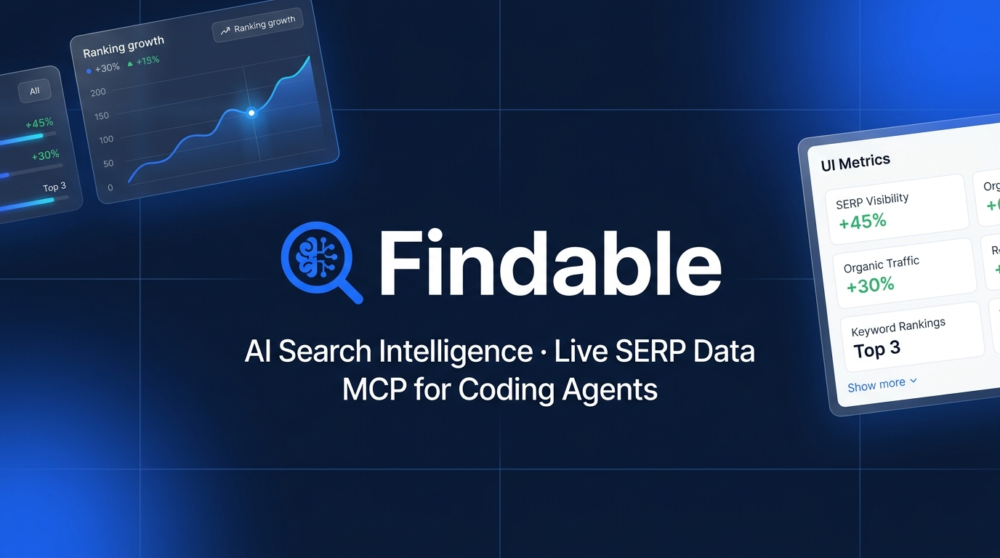

# Findable

<p align="center">
  
</p>

<p align="center">
  <strong>The AI-powered SEO engine and search intelligence platform for humans and AI agents.</strong>
</p>

<p align="center">
  <a href="https://findableweb.io">Website</a> •
  <a href="https://app.findableweb.io">Web Application</a> •
  <a href="https://findableweb.io/docs/mcp">MCP Documentation</a> •
  <a href="https://findableweb.io/pricing">Pricing</a> •
  <a href="https://findableweb.io/blogs">Blog</a>
</p>

---

## 📌 Overview

**Findable** is an all-in-one SEO and search intelligence platform designed for the modern web and the era of conversational AI. It unifies traditional Google search optimization, live SERP synthesis, 1-click AI article generation with structured schema, and Generative Engine Optimization (GEO) tracking across ChatGPT, Perplexity, Claude, and Gemini.

Built on an edge-native serverless architecture (Cloudflare Workers, TanStack Start, D1/Postgres, and Durable Objects), Findable also exposes a first-class **Model Context Protocol (MCP)** server, allowing AI coding assistants (Claude Code, Cursor, Codex, OpenCode) to perform end-to-end SEO research and technical audits directly from your IDE or terminal.

---

## ✨ Key Features

### 🚀 1-Click AI Article Generator
- **Live SERP Synthesis:** Pulls real-time Google search results and analyzes top-ranking structures, search intent, and People Also Ask (PAA) questions before generating content.
- **Built-in FAQ Schema (JSON-LD):** Generates structured data blocks out-of-the-box for enhanced Google Rich Results snippets.
- **Human-in-the-Loop:** Export directly to Markdown, HTML, or copy straight to your CMS (WordPress, Webflow, Next.js).

### 🤖 Generative Engine Optimization (GEO) & AI Brand Visibility
- Monitor whether your brand and content are being cited and recommended in conversational AI search engines: **ChatGPT Search, Perplexity AI, Claude, and Gemini**.
- Track AI brand sentiment, response frequency, and competitor citations.

### 🔍 Keyword Research & Clustering
- Discover high-intent keyword ideas with accurate monthly search volume, keyword difficulty (KD 0–100), and CPC metrics.
- **Topical Clustering:** Group keywords by semantic intent to build pillar pages and topic clusters that establish Topical Authority.
- **Native Polish & Multi-language Support:** Full linguistic support for inflection and search intent across English, Spanish, and Polish.

### 📈 Daily Real-Time Rank Tracking
- Monitor desktop and mobile rankings across 190+ countries and specific local municipalities.
- Track SERP features: Featured Snippets, Local Pack, Knowledge Panels, and PAA carousels.

### 🛠️ Technical Site Audit & Core Web Vitals
- Built-in crawler that audits status codes (404s, redirect chains), missing canonical tags, robots.txt directives, and sitemap health.
- Real-time diagnostics for **LCP (Largest Contentful Paint)**, **INP (Interaction to Next Paint)**, and **CLS (Cumulative Layout Shift)**.

### 🔗 Backlink & Domain Analytics
- Inspect referring domains, dofollow/nofollow ratios, domain rank scores, and anchor text distributions without third-party bloated tool suites.

### 📊 Native Google Search Console & GA4 Sync
- Direct OAuth 2.0 integration with Google Search Console to detect **Striking Distance keywords (positions 4–20)** and traffic trends.
- Google Analytics 4 synchronization for organic conversion tracking.

### 🌍 Multi-Language Platform
- Complete UI, settings, and workflows translated into **English, Spanish, and Polish** with seamless runtime switching.

---

## 🔌 Model Context Protocol (MCP) & AI Agent Integration

Findable includes an open-standard **MCP Server**, enabling AI coding agents to access live SEO data directly within your development workflows.

### Hosted MCP Endpoint
```txt
https://app.findableweb.io/mcp
```

### Supported AI Clients
- **Claude Code:** Terminal-based agent execution.
- **Cursor IDE:** Background context for frontend and content development.
- **Codex / OpenCode:** Headless CI/CD SEO verification.

### Quick Setup with Claude Code
```bash
claude mcp add --transport http --scope user findable https://app.findableweb.io/mcp
```

### Available MCP Tools
| Tool Name | Description |
|---|---|
| `findable.keyword_research` | Discover keyword ideas, search volume, KD, and search intent. |
| `findable.serp_inspect` | Pull live Google search results, URLs, titles, and snippets. |
| `findable.domain_overview` | Retrieve domain organic traffic estimates, ranking distribution, and top pages. |
| `findable.backlinks` | Inspect referring domains, backlink strength, and anchor text. |
| `findable.gsc_performance` | Query Google Search Console clicks, impressions, CTR, and positions. |
| `findable.site_audit` | Audit HTML tags, canonical URLs, headers, and structured schema. |

---

## 🏗️ Architecture & Tech Stack

Findable is designed as a high-performance, modular monorepo deployed on Cloudflare's global edge network.

```
                              ┌───────────────────────────────┐
                              │      Cloudflare Edge CDN      │
                              └───────────────┬───────────────┘
                                              │
                     ┌────────────────────────┴────────────────────────┐
                     │                                                 │
                     ▼                                                 ▼
        ┌─────────────────────────┐                       ┌─────────────────────────┐
        │   findableweb.io (web/)  │                       │   app.findableweb.io    │
        │  Marketing, Docs & Blog │                       │    Full-Stack Web App   │
        └────────────┬────────────┘                       └────────────┬────────────┘
                     │                                                 │
                     │  TanStack Start                                 │  TanStack Start
                     │  Fumadocs MDX                                   │  React 19 / DaisyUI
                     │  Tailwind CSS                                   │  Cloudflare Workers
                     │                                                 │
                     └────────────────────────┬────────────────────────┘
                                              │
                     ┌────────────────────────┴────────────────────────┐
                     │          Cloudflare Serverless Services         │
                     ├─────────────────────────────────────────────────┤
                     │ • Durable Objects: Strategy & Onboarding Agents │
                     │ • Workflows: Automated Site Audits & Rank Checks│
                     │ • D1 Database (SQLite) / Postgres via Hyperdrive│
                     │ • KV Namespaces: Rate limits, cache, OAuth state│
                     │ • MCP Endpoint: JSON-RPC over HTTP (/mcp)       │
                     └────────────────────────┬────────────────────────┘
                                              │
                     ┌────────────────────────┴────────────────────────┐
                     │               External Integrations             │
                     ├─────────────────────────────────────────────────┤
                     │ • DataForSEO API (SERP, Backlinks, Volumes)     │
                     │ • Google Search Console & GA4 (OAuth 2.0)       │
                     │ • OpenRouter / Anthropic (AI Article Synthesis) │
                     │ • Polar / Stripe (Subscription & Credits)       │
                     └─────────────────────────────────────────────────┘
```

### Technology Highlights

- **Framework:** [TanStack Start](https://tanstack.com/start) with full-stack type safety, file-based routing, and server functions.
- **Frontend:** React 19, Tailwind CSS v4, and DaisyUI with custom brand themes (`findable` Light & `findable-dark`).
- **Runtime:** Cloudflare Workers with `nodejs_compat`.
- **Database & ORM:** [Drizzle ORM](https://orm.drizzle.team) supporting dual targets:
  - **SQLite (Cloudflare D1):** Zero-cold-start edge storage for hosted instances.
  - **Postgres (Hyperdrive / Neon):** High-throughput relational storage for self-hosted instances.
- **Authentication:** Better-Auth with email/password and Google OAuth.
- **Stateful Edge Compute:** Cloudflare Durable Objects for persistent chat sessions (`OnboardingChatAgent`, `SamChatAgent`) and Workflows for distributed crawling.

---

## 📂 Repository Structure

```
├── web/                       # Marketing website, documentation & blog (findableweb.io)
│   ├── content/               # MDX documentation and blog articles (English & Polish)
│   ├── src/
│   │   ├── components/        # Landing page, pricing, and brand UI components
│   │   ├── routes/            # TanStack file-based marketing routes
│   │   └── lib/               # i18n, SEO helpers, feature pages data
│   └── wrangler.jsonc         # Cloudflare Worker config for findableweb.io
│
├── src/                       # Main full-stack web application (app.findableweb.io)
│   ├── client/                # React 19 application components, hooks, features
│   │   ├── features/          # AI Search, Articles, Billing, Keywords, Backlinks, GSC
│   │   ├── components/        # Reusable UI primitives and layout structures
│   │   └── styles/            # App CSS and DaisyUI theme definitions
│   ├── server/                # Server functions, MCP server implementation, agents
│   ├── db/                    # Drizzle ORM schemas, D1 and Postgres migrations
│   ├── routes/                # Authenticated and app route handlers
│   └── server.ts              # Cloudflare Worker entry point
│
├── docs/                      # Technical documentation & self-hosting guides
│   ├── LOCAL_DEVELOPMENT.md   # Local setup instructions
│   ├── SELF_HOSTING_CLOUDFLARE.md
│   ├── SELF_HOSTING_DOCKER.md
│   └── DATAFORSEO_API_KEY.md
│
└── wrangler.jsonc             # Cloudflare Worker configuration for app.findableweb.io
```

---

## 🛠️ Getting Started (Local Development)

### Prerequisites
- **Node.js:** v20.x or later
- **Package Manager:** `pnpm` (v10.x recommended)
- **Cloudflare CLI:** `wrangler` (`npm install -g wrangler`)

### 1. Clone the repository
```bash
git clone https://github.com/jorgebendekj/OpenSeo.git findable
cd findable
```

### 2. Install dependencies
```bash
# Install root dependencies
pnpm install

# Install marketing/web dependencies
cd web && npm install && cd ..
```

### 3. Configure environment variables
Copy the example environment file:
```bash
cp .env.example .env
```
Provide the required keys:
- `DATAFORSEO_LOGIN` and `DATAFORSEO_PASSWORD` (or API key)
- `BETTER_AUTH_SECRET` (generate with `openssl rand -hex 32`)
- `OPENROUTER_API_KEY` (for AI article generation)

### 4. Run local database migrations (D1)
```bash
pnpm wrangler d1 migrations apply DB --local
```

### 5. Start development servers
```bash
# Start the web application (app)
pnpm dev

# Start the marketing site (web) in another terminal
cd web && npm run dev
```

For detailed instructions, see [`docs/LOCAL_DEVELOPMENT.md`](./docs/LOCAL_DEVELOPMENT.md).

---

## 🌐 Self-Hosting

Findable is designed to be fully self-hostable:

- **Cloudflare (Recommended):** Deploy to your own Cloudflare account using Workers, D1, KV, and Workflows on the free or paid plan. See [`docs/SELF_HOSTING_CLOUDFLARE.md`](./docs/SELF_HOSTING_CLOUDFLARE.md).
- **Docker:** Run on any VPS (DigitalOcean, Hetzner, AWS) with Docker and Docker Compose. See [`docs/SELF_HOSTING_DOCKER.md`](./docs/SELF_HOSTING_DOCKER.md).

---

## 💳 Pricing & Plans

| Plan | Price | Target Audience | Features |
|---|---|---|---|
| **Free Forever** | **$0** | Explorers & Solo Creators | 1 website, 100 monthly credits, GSC & GA4 sync, full MCP access |
| **Starter** | **$39 / mo** | Freelancers & Small Sites | 3 websites, 10,000 credits, 10 AI articles/mo, daily rank tracking |
| **Autopilot (Growth)** | **$69 / mo** | Growing Businesses & SaaS | 6 websites, 35,000 credits, 30 AI articles/mo, ChatGPT & Perplexity GEO tracking |
| **Scale / Agency** | **$99 / mo** | Agencies & Power Users | 15 websites, 100,000 credits, 100 AI articles/mo, white-label reporting & team seats |

---

## 🤝 Contributing

Contributions are welcome! Whether it's reporting an issue, improving documentation, or submitting a pull request, please review [`docs/CONTRIBUTING.md`](./docs/CONTRIBUTING.md) before getting started.

---

## 📄 License

This repository is licensed under the MIT License. See [LICENSE](./LICENSE) for details.
